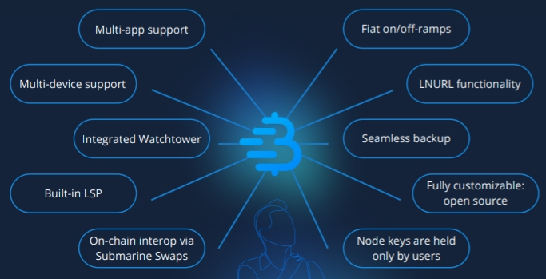

# Breez SDK
This replit showcases how to use the Breez SDK, to integrate noncustodial 
lightning payments into your user-facing applications. This example is written
in Rust, but there's bindings for many other languages available.

## Intro
In a nutshell, Breez SDK provides app developers with an easy to implement and
intuitive set of tools to integrate lightning payments into applications. An end
user of an application built with Breez SDK will have a single balance across
multiple apps, so different apps reuse the same lightning balance. 

The user's personal lightning node is hosted in the cloud, in Greenlight, a 
product by Blockstream. Greenlight manages the node infrastructure and ensures
the user doesn't need to worry about data security, backups, firewalls and 
other stuff that is inherent to hosting software. The node is useless however, 
without a connected signer. The signer signs messages needed to connect to the
lightning network and to send/receeive payments and open channels, etc. This
validating signer is run inside the user facing app. This is what allows non-
custodial lightning payments in a cloud-hosted infrastructure.

The SDK manages liquidity by leveraging Lightning Service Providers (LSP). When
inbound liquidity would be depleted, a just-in-time lightning channel is opened
to the user's node when the user is about to receive the payment. The LSP is 
what connects the user's personal lightning node to the lightning network, by
creating channels with a well-connected lightning node.

## Tutorial
This tutorial will integrate lightning payments into a simple console app, using
rust.

[Next page](./01-prerequisites.md)